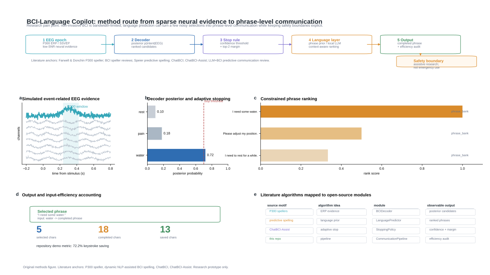

# BCI-Language Copilot



Predictive communication for EEG-based assistive BCI.

This project is an open-source research prototype for combining BCI intent decoding with language prediction. The first milestone focuses on a runnable mock/offline demo: simulated BCI probabilities select intents or partial text, then a language module completes communicative phrases and reports input-efficiency metrics.

> Research prototype only. This project does not provide medical diagnosis, clinical treatment, or emergency communication guarantees.

## Why This Project

Traditional BCI spellers often require many selections to express one sentence. Large language models and constrained phrase banks can reduce the number of selections by predicting likely expressions from context. This project explores that interaction loop in a transparent and reproducible way.

## Month-1 Goals

- Provide a working mock BCI communication demo.
- Implement a pluggable decoder interface for P300, SSVEP, and simulated probability streams.
- Provide a language prediction layer with phrase-bank and provider-ready LLM interfaces.
- Track keystroke savings, top-k hit rate, and completion latency.
- Prepare a clean application demo suitable for README screenshots and short videos.

## Quick Start

Mac development uses the system `python3` directly and does not create a `.venv`:

```bash
python3 -m pip install -e ".[dev]"
python3 -m pytest -q
python3 -m bci_language_copilot.cli demo
```

Windows development should continue to use the existing project interpreter:

```powershell
D:\AI_Env\dl_5060ti\python.exe -m pip install -e ".[dev]"
D:\AI_Env\dl_5060ti\python.exe -m pytest -q
D:\AI_Env\dl_5060ti\python.exe -m bci_language_copilot.cli demo
```

See [docs/SETUP_MAC.md](docs/SETUP_MAC.md) and [docs/SETUP_WINDOWS.md](docs/SETUP_WINDOWS.md) for the full cross-platform workflow.

## Project Layout

```text
bci_language_copilot/
  cli.py
  decoder/
  language/
  metrics/
  ui/
docs/
  BACKGROUND.md
  ROADMAP.md
  TECHNICAL_PLAN.md
tests/
```

## Current Demo

The initial CLI demo simulates BCI candidate probabilities and generates phrase completions from a constrained assistive communication phrase bank.

```bash
python -m bci_language_copilot.cli demo --context clinical
```

## Roadmap

See [docs/ROADMAP.md](docs/ROADMAP.md).
